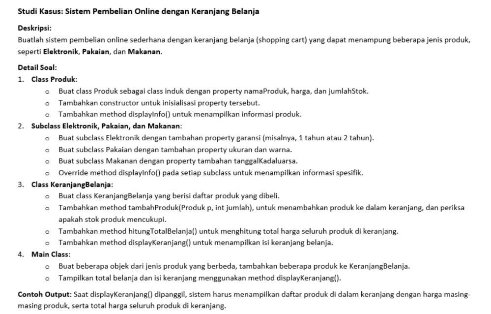
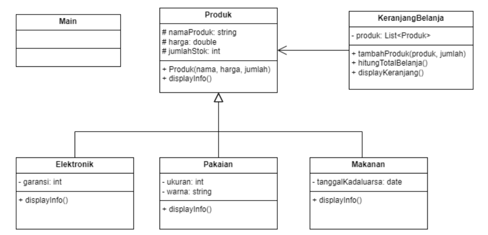

# Constructor
## Praktikum Pertemuan Ke 7 Pemrograman Orientasi Objek.


 <br> <br>
 

<br> <br>


### File <b>main.java</b>

``` java
package AlfaMantul;
import java.util.Date;

public class main {
    public static void main(String[] args) {
        // Membuat beberapa produk
        elektronik laptop = new elektronik("Laptop", 8000000, 8, 2);
        pakaian kaos = new pakaian("Kaos", 110000, 7, "M", "Hitam");
        makanan kacang = new makanan("Kacang Pilus", 5000, 28, new Date());

        // Membuat keranjang belanja
        keranjangBelanja keranjang = new keranjangBelanja();

        // Menambahkan produk ke keranjang
        keranjang.tambahProduk(tv, 1);
        keranjang.tambahProduk(kaos, 2);
        keranjang.tambahProduk(roti, 5);

        // Menampilkan isi keranjang
        keranjang.displayKeranjang();
    }
}
```
<br>

<b>Penjelasan</b> <br>
1. Deklarasi package dan Impor

``` java
package AlfaMantul;
import java.util.Date;
```

```Package AlfaMantul``` mengelompokkan semua kelas terkait dalam proyek ini agar terorganisir dan mudah diakses. Kelas Date dari pustaka Java diimpor untuk menangani tanggal kadaluarsa pada produk makanan. <br> <br> <br>


2. Kelas ```main```

``` java
public class main {
    public static void main(String[] args) {
        // Kode di sini
    }
}
```

Kelas ```main``` adalah titik awal program dan berisi metode ```main```, yang dijalankan pertama kali saat program dimulai. <br> <br> <br>


3. Membuat Objek Produk <br>

Di sini, tiga objek produk dari berbagai jenis dibuat: elektronik, pakaian, dan makanan. Setiap produk memiliki properti yang relevan seperti harga, stok, dan atribut khusus untuk setiap jenis produk.

``` java
elektronik laptop = new elektronik("Laptop", 8000000, 8, 2);
pakaian kaos = new pakaian("Kaos", 110000, 7, "M", "Hitam");
makanan kacang = new makanan("Kacang Pilus", 5000, 28, new Date());
```

```laptop``` : Objek ```elektronik``` dengan nama "Laptop", harga 8.000.000, stok 8 unit, dan garansi 2 tahun. <br> 
```kaos``` : Objek ```pakaian``` dengan nama "Kaos", harga 110.000, stok 7 unit, ukuran "M", dan warna "Hitam". <br> 
```kacang``` : Objek ```makanan``` dengan nama "Kacang Pilus", harga 5.000, stok 28 unit, dan tanggal kedaluwarsa yang diatur pada tanggal saat program dijalankan.
<br> <br> <br>


4. Membuat Objek keranjangBelanja

``` java
keranjangBelanja keranjang = new keranjangBelanja();
```

Objek ```keranjang``` dari kelas ```keranjangBelanja``` dibuat untuk menyimpan produk yang dipilih pengguna. ```keranjangBelanja``` bertindak sebagai penyimpanan sementara untuk produk yang akan dibeli. <br> <br> <br> 


5. Menambahkan Produk ke Keranjang

``` java
keranjang.tambahProduk(laptop, 1);
keranjang.tambahProduk(kaos, 2);
keranjang.tambahProduk(kacang, 5);
```

Metode ```tambahProduk``` pada objek ```keranjang``` menambahkan produk beserta kuantitasnya ke keranjang belanja. Di sini :

```laptop``` ditambahkan dengan kuantitas 1 unit. <br>
```kaos``` ditambahkan dengan kuantitas 2 unit. <br>
```kacang``` ditambahkan dengan kuantitas 5 unit. <br> <br> <br>


6. Menampilkan Isi Keranjang

``` java
keranjang.displayKeranjang();
```

Metode ```displayKeranjang``` menampilkan semua produk yang telah ditambahkan ke keranjang belanja beserta detailnya, seperti nama produk, harga, kuantitas, dan total harga. <br> <br> <br> <br>


### File <b>Produk.java</b>

``` java
package AlfaMantul;
public class Produk {
    private String namaProduk;
    private int harga;
    private int jumlahStok;

    public Produk(String namaProduk, int harga, int jumlahStok) {
        this.namaProduk = namaProduk;
        this.harga = harga;
        this.jumlahStok = jumlahStok;
    }

    // Setter NamaProduk
    public String getNamaProduk() {
        return namaProduk;
    }

    // Setter Harga
    public int getHarga() {
        return harga;
    }

    // Setter JumlahStok
    public int getJumlahStok() {
        return jumlahStok;
    }


    public void kurangiStok(int jumlah) {
        this.jumlahStok -= jumlah;
    }

    public void displayInfo(){
        System.out.println("Toko Alfa Mantul");
        System.out.println("Nama Produk : " + namaProduk);
        System.out.println("Harga Produk : " + harga);
        System.out.println("Jumlah Stok : " + jumlahStok);
    }
}
```
<br>

<b>Penjelasan</b> <br>
1. Deklarasi Package

```java
package AlfaMantul;
```

Package ```AlfaMantul``` digunakan untuk mengelompokkan kelas ini bersama kelas-kelas lainnya yang berkaitan dalam satu modul atau direktori. <br> <br> <br>


2. Kelas ```Produk```

``` java
public class Produk {
    // Kode di dalam kelas
}
```

Kelas ```Produk``` bersifat ```public```, sehingga dapat diakses oleh kelas lain di luar paket ini. Kelas ini berisi atribut dan metode yang berkaitan dengan informasi dasar produk. <br> <br> <br>


3. Atribut (Properti Produk)

``` java
private String namaProduk;
private int harga;
private int jumlahStok;
```

Atribut ```namaProduk```, ```harga```, dan ```jumlahStok``` masing-masing digunakan untuk menyimpan : <br> <br>

```namaProduk``` : Nama dari produk, misalnya "Laptop" atau "Kaos".<br>

```harga``` : Harga produk dalam bentuk bilangan bulat (integer).<br>

```jumlahStok``` : Jumlah stok produk yang tersedia. <br>

Atribut-atribut ini dideklarasikan sebagai ```private```, yang artinya hanya dapat diakses dari dalam kelas ```Produk``` saja, sehingga tidak bisa diakses langsung oleh kelas luar. <br> <br> <br>


4. Konstruktor ```Produk```

``` java
public Produk(String namaProduk, int harga, int jumlahStok) {
    this.namaProduk = namaProduk;
    this.harga = harga;
    this.jumlahStok = jumlahStok;
}
```

Konstruktor ini digunakan untuk menginisialisasi objek ```Produk``` dengan nilai-nilai awal untuk ```namaProduk```, ```harga```, dan ```jumlahStok```. Ketika objek ```Produk``` dibuat, nilai-nilai yang diberikan sebagai parameter akan disimpan ke dalam atribut kelas. <br> <br> <br>


5. Metode Getter

``` java
public String getNamaProduk() {
    return namaProduk;
}

public int getHarga() {
    return harga;
}

public int getJumlahStok() {
    return jumlahStok;
}
```

Ketiga metode di atas adalah metode "getter", yang berfungsi untuk mengakses nilai dari atribut ```namaProduk```, ```harga```, dan ```jumlahStok```. Metode ini memungkinkan kelas lain untuk mengambil nilai atribut tersebut tanpa perlu mengaksesnya secara langsung. <br> <br> <br>


6. Metode ```kurangiStok```

``` java
public void kurangiStok(int jumlah) {
    this.jumlahStok -= jumlah;
}
```

Metode ```kurangiStok``` digunakan untuk mengurangi jumlah stok produk. Metode ini menerima parameter ```jumlah```, yang kemudian akan dikurangkan dari ```jumlahStok```. Ini berguna, misalnya, ketika ada pembelian produk sehingga stoknya berkurang. <br> <br> <br>


7. Metode ```displayInfo```

``` java
public void displayInfo(){
    System.out.println("Toko Alfa Mantul");
    System.out.println("Nama Produk : " + namaProduk);
    System.out.println("Harga Produk : " + harga);
    System.out.println("Jumlah Stok : " + jumlahStok);
}
```

Metode ```displayInfo``` digunakan untuk menampilkan informasi produk ke layar, termasuk nama toko, nama produk, harga produk, dan jumlah stok yang tersedia. Metode ini memberikan output yang informatif tentang produk ketika dipanggil. <br> <br> <br> <br>


### File <b>elektronik.java</b>

``` java
package AlfaMantul;
public class elektronik extends Produk {
    private int garansi;

    public elektronik (String namaProduk, int harga, int jumlahStok, int garansi) {
        super(namaProduk, harga, jumlahStok);
        this.garansi = garansi;
    }

    // Setter dan Getter Garansi
    public int getGaransi() {
        return garansi;
    }

    public void setGaransi(int garansi) {
        this.garansi = garansi;
    }

    @Override
    public void displayInfo() {
        super.displayInfo();
        System.out.println("Garansi : " + this.garansi + " tahun");

    }
}
```
<br>

1. Deklarasi package

``` java
package AlfaMantul;
```

Kelas ```elektronik``` dikelompokkan ke dalam package ```AlfaMantul```, bersama kelas-kelas lain dalam sistem yang sama. <br> <br> <br>


2. Kelas elektronik dan Pewarisan

``` java
public class elektronik extends Produk {
    // Kode di dalam kelas
}
```

Kelas ```elektronik``` dideklarasikan sebagai ```public```, sehingga dapat diakses oleh kelas lain. Kelas ini menggunakan konsep pewarisan (inheritance) dengan kata kunci ```extends```, yang menunjukkan bahwa elektronik adalah turunan dari kelas ```Produk```. Dengan pewarisan ini, kelas ```elektronik``` mewarisi semua atribut dan metode dari kelas ```Produk```, seperti ```namaProduk```, ```harga```, j```umlahStok```, dan metode ```displayInfo```. <br> <br> <br>


3. Atribut ```garansi```

``` java
private int garansi;
```

Atribut ```garansi``` menyimpan informasi tambahan khusus untuk produk elektronik, yaitu lama garansi dalam tahun. Atribut ini bertipe ```int``` dan bersifat ```private```, yang berarti hanya dapat diakses dalam kelas ```elektronik```. <br> <br> <br>


4. Konstruktor ```elektronik```

``` java
public elektronik (String namaProduk, int harga, int jumlahStok, int garansi) {
    super(namaProduk, harga, jumlahStok);
    this.garansi = garansi;
}
```

Konstruktor ```elektronik``` digunakan untuk menginisialisasi objek ```elektronik``` dengan nilai-nilai yang diperlukan : <br>

```namaProduk``` : Nama produk elektronik.<br>
```harga``` : Harga produk elektronik.<br>
```jumlahStok``` : Jumlah stok produk elektronik. <br>
```garansi``` : Lama garansi produk dalam tahun. <br> <br>

Kata kunci ```super``` digunakan untuk memanggil konstruktor dari kelas ```Produk```, yang akan menginisialisasi atribut ```namaProduk```, ```harga```, dan ```jumlahStok```. Setelah itu, atribut ```garansi``` diatur sesuai dengan parameter yang diterima. <br> <br> <br>


5. Metode Getter dan Setter ```garansi```

``` java
public int getGaransi() {
    return garansi;
}

public void setGaransi(int garansi) {
    this.garansi = garansi;
}
```

```getGaransi``` : Metode ini mengembalikan nilai ```garansi```, yang memungkinkan kelas lain untuk membaca informasi garansi produk elektronik. <br> <br>

```setGaransi``` : Metode ini mengubah nilai ```garansi```, yang memungkinkan pengaturan ulang lama garansi jika dibutuhkan. <br> <br> <br>


6. Override Metode ```displayInfo```

``` java
@Override
public void displayInfo() {
    super.displayInfo();
    System.out.println("Garansi : " + this.garansi + " tahun");
}
```

Metode ```displayInfo``` di-override (diubah) dari versi aslinya di kelas ```Produk```. Dengan kata kunci ```@Override```, metode ini akan menambahkan informasi garansi produk elektronik. Metode ini memanggil ```super.displayInfo()``` untuk menampilkan informasi dasar produk dari kelas ```Produk```, lalu menambahkan detail ```garansi``` dengan output ```Garansi : <nilai garansi> tahun```. <br> <br> <br> <br>


### File <b>pakaian.java</b>

``` java
package AlfaMantul;

public class pakaian extends Produk {
    private String ukuran;
    private String warna;

    public pakaian (String namaProduk, int harga,int jumlahStok, String ukuran, String warna) {
        super(namaProduk, harga, jumlahStok);
        this.ukuran = ukuran;
        this.warna = warna;
    }

    // Setter Ukuran
    public String getUkuran() {
        return ukuran;
    }

    // Setter Warna
    public String getWarna() {
        return warna;
    }

    @Override
    public void displayInfo(){
        super.displayInfo();
        System.out.println("Ukuran : " + this.ukuran);
        System.out.println("Warna : " + this.warna);
    }

}
```
<br>

1. Deklarasi Package

``` java
package AlfaMantul;
```

Package ```AlfaMantul``` digunakan untuk mengelompokkan kelas ```pakaian``` bersama dengan kelas lain dalam proyek yang sama. <br> <br> <br>


2. Kelas ```pakaian``` dan ```Pewarisan```

``` java
public class pakaian extends Produk {
    // Kode di dalam kelas
}
```

Kelas ```pakaian``` adalah subclass dari ```Produk```, yang artinya ```pakaian``` mewarisi semua atribut dan metode dari ```Produk```. Dengan kata kunci ```extends```, kelas ini memperoleh atribut dasar seperti ```namaProduk```, ```harga```, dan ```jumlahStok``` serta metode seperti ```displayInfo``` dari kelas induknya. <br> <br> <br>


3. Atribut ```ukuran``` dan ```warna```

``` java
private String ukuran;
private String warna;
```

Kelas ```pakaian``` memiliki dua atribut tambahan : <br>

```ukuran``` : Menyimpan ukuran produk pakaian, misalnya "M", "L", atau "XL". <br>
```warna``` : Menyimpan warna produk pakaian, misalnya "Hitam" atau "Biru". <br> <br>

Kedua atribut ini bersifat ```private```, sehingga hanya dapat diakses dan diubah melalui metode di dalam kelas ```pakaian```. <br> <br> <br>


4. Konstruktor ```pakaian```

``` java
public pakaian (String namaProduk, int harga, int jumlahStok, String ukuran, String warna) {
    super(namaProduk, harga, jumlahStok);
    this.ukuran = ukuran;
    this.warna = warna;
}
```

Konstruktor ```pakaian``` digunakan untuk menginisialisasi objek dengan atribut yang dibutuhkan : <br>

```namaProduk``` : Nama produk pakaian. <br>
```harga``` : Harga produk. <br>
```jumlahStok``` : Jumlah stok produk yang tersedia. <br>
```ukuran``` : Ukuran pakaian. <br>
```warna``` : Warna pakaian. <br> <br>

Konstruktor ini memanggil konstruktor kelas ```Produk``` dengan ```super```, yang menginisialisasi ```namaProduk```, ```harga```, dan ```jumlahStok```, sementara ```ukuran``` dan ```warna``` diatur di dalam konstruktor ```pakaian``` sendiri. <br> <br> <br>


5. Metode Getter ukuran dan warna

``` java
public String getUkuran() {
    return ukuran;
}

public String getWarna() {
    return warna;
}
```

Metode ini adalah getter yang mengembalikan nilai ```ukuran``` dan ```warna``` : <br>

```getUkuran``` : Mengembalikan ukuran pakaian. <br>
```getWarna``` : Mengembalikan warna pakaian. <br> <br>

Metode ini memungkinkan atribut ```ukuran``` dan ```warna``` diakses dari luar kelas ```pakaian```. <br> <br> <br>


6. Override Metode ```displayInfo```

``` java
@Override
public void displayInfo(){
    super.displayInfo();
    System.out.println("Ukuran : " + this.ukuran);
    System.out.println("Warna : " + this.warna);
}
```

Metode ```displayInfo``` di-override dari kelas ```Produk```. Dengan ```@Override```, metode ini memanggil ```super.displayInfo()``` untuk menampilkan informasi dasar dari ```Produk```, seperti ```namaProduk```, ```harga```, dan ```jumlahStok```. Setelah itu, informasi ```ukuran``` dan ```warna``` ditambahkan untuk melengkapi deskripsi produk pakaian. <br> <br> <br> <br> 


### File <b>makanan.java</b>

``` java
package AlfaMantul;

import java.util.Date;

public class makanan extends Produk {
    private Date exp;

    public makanan(String namaProduk,int harga,int jumlahStok, Date exp) {
        super(namaProduk, harga, jumlahStok);
        this.exp = exp;
    }

    @Override
    public void displayInfo(){
        super.displayInfo();
        System.out.println("Tanggal Exp : " + this.exp);
    }

}
```
<br>

1. Deklarasi Package dan Impor Kelas

``` java
package AlfaMantul;
import java.util.Date;
```

Kode ini berada dalam package ```AlfaMantul```, yang mengelompokkan kelas ```makanan``` bersama kelas-kelas lain dalam proyek ini. Kelas ```Date``` diimpor dari pustaka Java, digunakan untuk menyimpan data tanggal kedaluwarsa produk makanan. <br> <br> <br>


2. Kelas ```makanan``` dan Pewarisan

``` java
public class makanan extends Produk {
    // Kode di dalam kelas
}
```

Kelas ```makanan``` merupakan subclass dari kelas ```Produk```. Dengan kata kunci ```extends```, kelas ini mewarisi semua atribut dan metode dari kelas ```Produk```, seperti ```namaProduk```, ```harga```, dan ```jumlahStok```, serta metode ```displayInfo```. <br> <br> <br>


3. Atribut ```exp```

``` java
private Date exp;
```

Atribut ```exp``` adalah variabel bertipe ```Date``` yang menyimpan tanggal kedaluwarsa (expired) produk makanan. Atribut ini bersifat ```private```, sehingga hanya dapat diakses melalui metode dalam kelas ```makanan```. <br> <br> <br>


4. Konstruktor ```makanan```

``` java
public makanan(String namaProduk, int harga, int jumlahStok, Date exp) {
    super(namaProduk, harga, jumlahStok);
    this.exp = exp;
}
```

Konstruktor ```makanan``` digunakan untuk menginisialisasi objek ```makanan``` dengan atribut yang diperlukan : <br> <br>

```namaProduk``` : Nama produk makanan. <br>
```harga``` : Harga produk. <br>
```jumlahStok``` : Jumlah stok produk yang tersedia. <br>
```exp``` : Tanggal kedaluwarsa produk. <br> <br>

Kata kunci ```super``` digunakan untuk memanggil konstruktor kelas ```Produk```, yang menginisialisasi ```namaProduk```, ```harga```, dan ```jumlahStok```. Setelah itu, atribut ```exp``` diatur menggunakan nilai ```Date``` yang diberikan sebagai parameter. <br> <br> <br>


5. Override Metode ```displayInfo```

``` java
@Override
public void displayInfo(){
    super.displayInfo();
    System.out.println("Tanggal Exp : " + this.exp);
}
```

Metode ```displayInfo``` di-override dari kelas ```Produk``` untuk menampilkan informasi tambahan mengenai tanggal kedaluwarsa. Dengan memanggil ```super.displayInfo()```, metode ini menampilkan informasi dasar produk seperti ```namaProduk```, ```harga```, dan ```jumlahStok```, kemudian menambahkan detail ```Tanggal Exp``` yang menunjukkan tanggal kedaluwarsa produk makanan. <br> <br> <br> <br>


### File <b>keranjangBelanja.java</b>

``` java
package AlfaMantul;
import java.util.ArrayList;

public class keranjangBelanja {
    private ArrayList<Produk> keranjang;

    public keranjangBelanja() {
        keranjang = new ArrayList<>();
    }

    public void tambahProduk(Produk p, int jumlah) {
        if (p.getJumlahStok() >= jumlah) {
            p.kurangiStok(jumlah);
            keranjang.add(p);
            System.out.println("Produk " + p.getNamaProduk() + " ditambahkan sebanyak " + jumlah);
        } else {
            System.out.println("Stok tidak mencukupi untuk produk " + p.getNamaProduk());
        }
    }

    public int hitungTotalBelanja() {
        int total = 0;
        for (Produk item : keranjang) {
            total += item.getHarga();
        }
        return total;
    }

    public void displayKeranjang() {
        System.out.println("Isi Keranjang Belanja :");
        for (Produk item : keranjang) {
            System.out.println("- " + item.getNamaProduk() + " = Rp" + item.getHarga());
        }
        System.out.println("Total Belanja : Rp" + hitungTotalBelanja());
    }
}
```
<br>

1. Deklarasi Package dan Impor Kelas

``` java
package AlfaMantul;
import java.util.ArrayList;
```

Kelas ```keranjangBelanja``` berada dalam paket ```AlfaMantul```, dan kelas ```ArrayList``` diimpor dari pustaka Java untuk menyimpan daftar produk dalam bentuk list dinamis. <br> <br> <br>


2. Deklarasi Kelas ```keranjangBelanja``` dan Atribut ```keranjang```

``` java
public class keranjangBelanja {
    private ArrayList<Produk> keranjang;
}
```

Kelas ```keranjangBelanja``` memiliki atribut ```keranjang```, yang merupakan ```ArrayList``` berisi objek ```Produk```. Dengan deklarasi ```private```, atribut ini hanya dapat diakses dalam kelas ```keranjangBelanja```. <br> <br> <br>


3. Konstruktor ```keranjangBelanja```

``` java
public keranjangBelanja() {
    keranjang = new ArrayList<>();
}
```

Konstruktor ini menginisialisasi atribut ```keranjang``` sebagai objek ```ArrayList```, siap untuk menyimpan produk-produk yang akan ditambahkan. <br> <br> <br>


4. Metode ```tambahProduk```

``` java
public void tambahProduk(Produk p, int jumlah) {
    if (p.getJumlahStok() >= jumlah) {
        p.kurangiStok(jumlah);
        keranjang.add(p);
        System.out.println("Produk " + p.getNamaProduk() + " ditambahkan sebanyak " + jumlah);
    } else {
        System.out.println("Stok tidak mencukupi untuk produk " + p.getNamaProduk());
    }
}
```

Metode ini digunakan untuk menambahkan produk ```p``` ke dalam keranjang dengan jumlah tertentu : <br> <br> 

Validasi Stok : Metode ini memeriksa apakah stok produk mencukupi untuk jumlah yang diminta. Jika stok mencukupi, stok produk dikurangi dengan ```kurangiStok```, lalu produk ditambahkan ke ```keranjang```. <br>

Pesan Kesuksesan atau Kegagalan : Jika produk berhasil ditambahkan, pesan konfirmasi ditampilkan. Jika stok tidak mencukupi, pesan peringatan muncul.<br> <br> <br>


5. Metode ```hitungTotalBelanja```

``` java
public int hitungTotalBelanja() {
    int total = 0;
    for (Produk item : keranjang) {
        total += item.getHarga();
    }
    return total;
}
```

Metode ini menghitung total belanja dalam keranjang dengan menjumlahkan harga setiap produk yang ada di dalam ```keranjang```. Nilai total dikembalikan dalam bentuk integer. <br> <br> <br>


6. Metode ```displayKeranjang```

``` java
public void displayKeranjang() {
    System.out.println("Isi Keranjang Belanja :");
    for (Produk item : keranjang) {
        System.out.println("- " + item.getNamaProduk() + " = Rp" + item.getHarga());
    }
    System.out.println("Total Belanja : Rp" + hitungTotalBelanja());
}
```

Metode ini digunakan untuk menampilkan daftar produk di keranjang beserta total harga belanja. Setiap produk dalam ```keranjang``` ditampilkan dengan nama dan harganya, diikuti dengan total keseluruhan yang dihitung melalui ```hitungTotalBelanja```.
